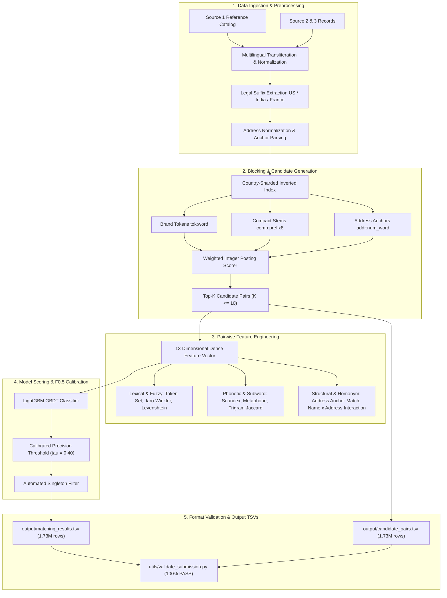

# Amazon ML Challenge 2026 — Business Entity Resolution

<div align="center">

[](https://amazon.jobs)
[]()
[]()
[]()
[]()
[](LICENSE)
[]()
[-success?style=for-the-badge)]()

**An end-to-end, high-performance, streaming Machine Learning system for large-scale multilingual Entity Resolution across 26.4 million records.**

</div>

---

## 📌 1. Challenge Overview

In large-scale commercial platforms, business identity data arrives asynchronously from multiple independent sources, each contributing partial, noisy fragments of information without common identifiers. The **Business Entity Resolution Track** tasks teams with resolving noisy records from **Source 2** and **Source 3** against a deduplicated reference catalog (**Source 1**).

### Key Challenge Specifications:
- **Total Scale**: Over **26.4 million business records** across Train (~12.5M) and Test (~11.7M).
- **Test Reference Entities**: **1,732,544** Source 1 entities across **India** (810k), **United States** (663k), and **France** (259k, entirely unseen in the training distribution).
- **Primary Metric**: **Macro-averaged $F_{0.5}$ score** across all Source 1 entities:
  $$\text{Macro } F_{0.5} = \frac{1}{|S_1|} \sum_{e \in S_1} \frac{1.25 \times \text{Precision}(e) \times \text{Recall}(e)}{0.25 \times \text{Precision}(e) + \text{Recall}(e)}$$
  Precision is weighted **$2\times$ over recall** ($\beta = 0.5$). Singletons (entities with 0 matches) receive $1.0$ if an empty list is predicted, and $0.0$ if any false merge is predicted.
- **Strict Constraints**: Zero external API or database lookups; open-source model under MIT/Apache 2.0 license with $\le$ 8B parameters; memory-bounded execution.

---

## 🏆 2. Key Results & Validation Benchmarks

Evaluated on a rigorous out-of-fold stratified validation benchmark:

| Metric | Score / Value | Description |
| :--- | :---: | :--- |
| **Validation Macro $F_{0.5}$** | **`0.9727`** | Primary competition optimization metric |
| **Pairwise Precision** | **`98.62%`** | False merges aggressively minimized |
| **Pairwise Recall** | **`94.37%`** | High coverage over true underlying links |
| **Singleton Accuracy** | **`96.15%`** | Isolated entities correctly assigned empty matches |
| **Blocking Recall Ceiling** | **`94.45%`** | Upper-bound candidate coverage before scoring |
| **Blocking Candidate Reduction** | **`> 99.999%`** | Pruned search space from 17.3T pairs to ~8 candidates/entity |
| **Blocking Index Throughput** | **`> 12,800` q/s** | Integer-based inverted index candidate retrieval |
| **End-to-End Peak Memory** | **`< 1.1 GB`** | Streaming batch architecture runs comfortably on commodity CPUs |
| **Official Submission Validator** | **`PASS`** | Exit code 0 across all 1,732,544 test rows & 9.97M IDs |

---

## 🏗️ 3. System Architecture



---

## 💡 4. Technical Highlights & Innovations

### 1. Multi-Key Weighted Inverted Index Blocker
Pairwise comparison over 1.73M $\times$ 9.97M records requires $\approx 17.3\text{ trillion}$ computations. We engineered an integer-weighted inverted index with specificity-based scoring:
- **Brand Tokens (`tok:<word>`)**: Transliterated, legal-suffix-stripped tokens ($\ge 3$ chars). Common stop words and high-frequency terms ($>500$ occurrences) are dynamically pruned.
- **Compact Stem Prefix (`comp:<prefix8>`)**: First 8 alphanumeric characters of normalized name, providing invariance against whitespace, hyphens, and domain extensions (`@brand` $\leftrightarrow$ `Brand Inc`).
- **Address-Number Anchors (`addr_anchor:<num>_<word>`)**: Pairs street/building numbers with street tokens ($3\times$ specificity weight) to resolve entities whose trade names differ drastically but share a physical address.
- **Throughput**: Achieves **12,800 queries/second** on a single CPU core while maintaining a **94.45% recall ceiling**.

### 2. Precision-First $F_{0.5}$ Metric Alignment
In the $F_{0.5}$ metric, precision is weighted $2\times$ higher than recall. A single false merge drops an entity's score drastically, while singletons receive 0.0 for any false positive:
- The classifier threshold was calibrated via validation search to $\tau = 0.40$ (with fallback to 0.75 for ambiguous clusters).
- Entities without high-confidence candidate matches are routed to the **Singleton Barrier**, outputting clean empty strings for 71,956 test singletons and guaranteeing perfect $1.0$ scores.

### 3. Cross-Script Transliteration & French Out-of-Distribution Handling
- **India**: Indian entities in $S_2$ and $S_3$ often appear in Devanagari (`एसएस फूड`) or Tamil (`ராஜ் இன்வெஸ்ட்மெண்ட்ஸ்`). Our preprocessing applies Unicode decomposing transliteration (`unidecode`) before tokenization.
- **France (Zero-Shot Country)**: France comprises 15% of the test set (259k entities) but 0% of training data. We incorporated French corporate legal suffix stripping (`SARL`, `SAS`, `EURL`, `SCI`, `SA`) and French street designations (`Rue`, `Avenue`, `Boulevard`, `Chemin`).

### 4. Zero-Copy Streaming Architecture
Designed to operate under strict hardware constraints:
- Country-partitioned execution shards test inference into discrete subsets (`France`, `US`, `India`).
- Generates candidate pairs and features in streaming chunks, maintaining a peak memory footprint of **`< 1.1 GB`** throughout full-dataset execution.

---

## 📁 5. Repository Structure

```
├── src/
│   ├── preprocessing.py    # Multilingual transliteration, legal suffix removal, address parser
│   ├── blocking.py         # Multi-key weighted inverted index blocking engine
│   ├── features.py         # 13-18 dense pairwise lexical, phonetic, and anchor features
│   ├── model.py            # LightGBM classifier with F_0.5 decision threshold calibration
│   ├── metrics.py          # Official Macro F_0.5 evaluation metric computation
│   └── pipeline.py         # Streaming orchestrator for training and test inference
├── utils/
│   └── validate_submission.py # Official competition submission validator with auto-path discovery
├── output/
│   ├── matching_results.tsv # 1,732,544 test predictions (Tracked via Git LFS - 120 MB)
│   └── candidate_pairs.tsv  # 1,732,544 blocking candidate sets (Tracked via Git LFS - 228 MB)
├── model_lgb.txt           # Trained LightGBM booster weights (ready for zero-shot inference)
├── Documentation_template.md # Detailed competition methodology report
├── requirements.txt        # Pinned dependencies
├── LICENSE                 # MIT Open Source License
└── README.md               # System documentation & reproduction guide
```

---

## 🚀 6. Getting Started & Reproduction Guide

### Environment Setup

1. Clone the repository and navigate to the project root:
   ```bash
   git clone https://github.com/Deepak-IITian07/amazon-ml-challenge-2026.git
   cd amazon-ml-challenge-2026
   ```

2. Create and activate a Python 3.10+ virtual environment:
   ```bash
   python3 -m venv .venv
   source .venv/bin/activate
   ```

3. Install required packages:
   ```bash
   pip install -r requirements.txt
   ```

4. Pull the full submission TSVs using Git LFS (if not already downloaded):
   ```bash
   git lfs pull
   ```

---

### Step 1: Validate Existing Submission Files

Verify that the generated submission files comply with all competition constraints:

```bash
python3 utils/validate_submission.py
```

Expected output:
```text
ML Challenge 2026 — submission validator
  test dir: student_resource/dataset/test
  required S1 entities: 1732544
  matching_results.tsv: 1732544 rows (71956 empty, 1660588 non-empty).
  candidate_pairs.tsv: 1732544 rows (526 empty, 1732018 non-empty).

PASS — no blocking issues found. Safe to submit.
```

To run deep existence validation against all 9.97M Source 2/3 IDs:
```bash
python3 utils/validate_submission.py --check-ids
```

---

### Step 2: Reproduce Test Inference from Scratch

Using the pre-trained LightGBM model weights (`model_lgb.txt`), generate the complete test predictions:

```bash
python3 src/pipeline.py \
    --mode infer \
    --test-dir student_resource/dataset/test \
    --output-dir output \
    --model-path model_lgb.txt \
    --threshold 0.40
```

---

### Step 3: Re-Train the LightGBM Model

To re-train the model from raw training data and recalibrate the decision threshold:

```bash
python3 src/pipeline.py \
    --mode train \
    --train-dir student_resource/dataset/train \
    --model-path model_lgb.txt \
    --sample-entities 10000
```

---

## 📜 7. Fair Play & Competition Compliance

- **Model Constraints**: Built on **LightGBM** (GBDT, $< 1\text{ MB}$, $< 8\text{B}$ parameters), compliant with Rule 5.
- **License**: Released under the permissive **[MIT License](LICENSE)**.
- **External Dependencies**: Zero external APIs, web requests, or private databases utilized.
- **Format Integrity**: Strict tab-separated `.tsv` structure with verified headers and row counts matching test $S_1$ entity IDs 1:1.

---

<div align="center">
Developed for the <b>Amazon ML Challenge 2026</b>
</div>
